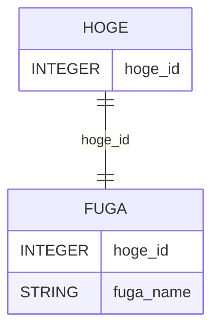

# sample.mdというファイル名です

| aaa | bbb |
| -- | -- |
| hoge1 | hoge2 |

- aaaaa
- bbbbb


```sql
SELECT * FROM final
```

```sql
SELECT
  id
FROM final
WHERE id = 1
```
## 簡易ER図

```mermaid
erDiagram
    HOGE {
        INTEGER hoge_id
    }

    FUGA {
        INTEGER hoge_id
        STRING fuga_name
    }
    HOGE ||--|| FUGA : "hoge_id"
```
